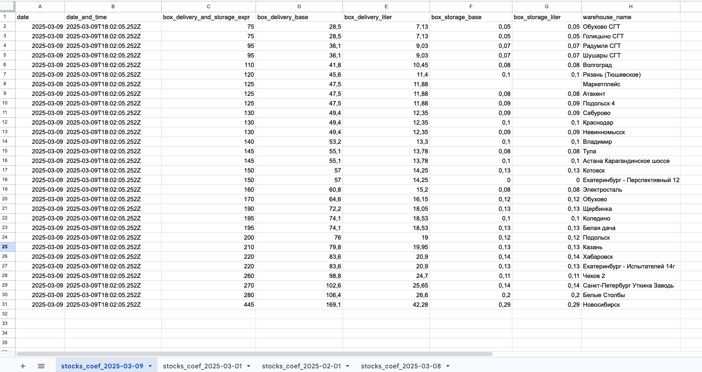

# Инструкция по запуску
Программа запускается при помощи 

```bash
docker compose -f 'compose.yaml' up -d --build
```

# .env
Добавьте требуемые приватные ключи в ваш файл .env для корректной работы сервиса. (Смотреть в [example.env](example.env) )

# Инструкция по Google Spreadsheet

📌 Как добавить сервисный аккаунт в Google Spreadsheets

Этот раздел объясняет, как создать сервисный аккаунт в Google Cloud, выдать ему доступ к Google Spreadsheets и использовать его для работы с API.

1️⃣ Создание сервисного аккаунта в Google Cloud

1. Перейдите в Google Cloud Console.

2. Выберите или создайте проект, в котором будет использоваться API Google Sheets.

3. Откройте "API & Services" → "Credentials" (Учётные данные).

4. Нажмите "Create Credentials" (Создать учётные данные) и выберите "Service Account" (Сервисный аккаунт).

5. Укажите имя и описание аккаунта, затем нажмите "Create".

6. На следующем шаге можете добавить роли (например, "Editor" для доступа к Google Sheets). Можно оставить без ролей и нажать "Continue".

7. После создания аккаунта откройте его и перейдите на вкладку "Keys" (Ключи).

8. Нажмите "Add Key" (Добавить ключ) → "JSON", чтобы скачать ключ.

9. Файл .json с приватным ключом будет загружен на ваш ПК. Из него нужно извлечь private_key и client_email если использовать .env для авторизации (Смотреть в [example.env](example.env)), либо поместить его в папку проекта и использовать json файл напрямую (Смотреть комментарии в файле src/services/spreadsheetsDataExport.ts)

2️⃣ Выдача доступа к Google Spreadsheets

1. Откройте Google Таблицу, к которой сервисный аккаунт должен получить доступ.

2. Нажмите "Share" (Поделиться) в правом верхнем углу.

3. В поле "Добавить пользователей" введите email сервисного аккаунта (найти его можно в Google Cloud Console на странице сервисных аккаунтов).

4. Установите разрешения:
"Editor" (Редактор) — если сервисный аккаунт должен изменять данные.

5. Нажмите "Send" (Отправить).

Теперь сервисный аккаунт может работать с таблицей через API.

# Пример выгрузки данных в spreadsheet
